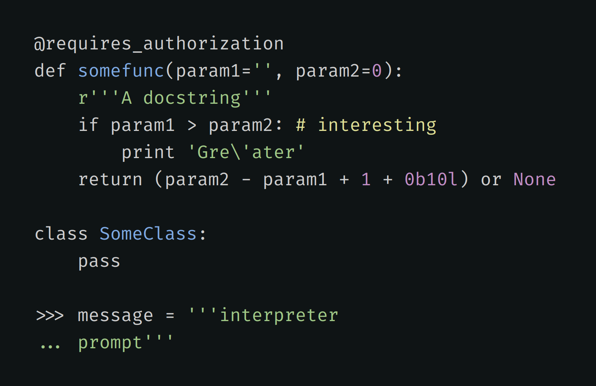

# Alabaster Dark Theme for Highlight.js


Most color themes highlight everything they can, ending up looking like a fireworks show.

Instead, Alabaster uses minimal highlighting. See [original motivation statement](https://github.com/tonsky/vscode-theme-alabaster#motivation).

## Demo

1. Download and extract this repository.
2. Open `index.html` in your browser.

## Usage

### Simplest way

Download [theme file](https://raw.githubusercontent.com/findrakecil/hljs-alabaster-dark/master/theme.css) and put it wherever you need.

### Advanced setup

If your build system supports importing CSS files from node_modules, you can install `hljs-alabaster-dark` as a dependency:

```
npm install hljs-alabaster-dark
```

And directly import it in your CSS:

```css
@import 'hljs-alabaster-dark';
```

## Credits

- [Highlight.js](https://highlightjs.org)
- [Original Alabaster theme](https://github.com/tonsky/vscode-theme-alabaster)
- [Alabaster Dark theme](https://github.com/gargakshit/vscode-theme-alabaster-dark)
